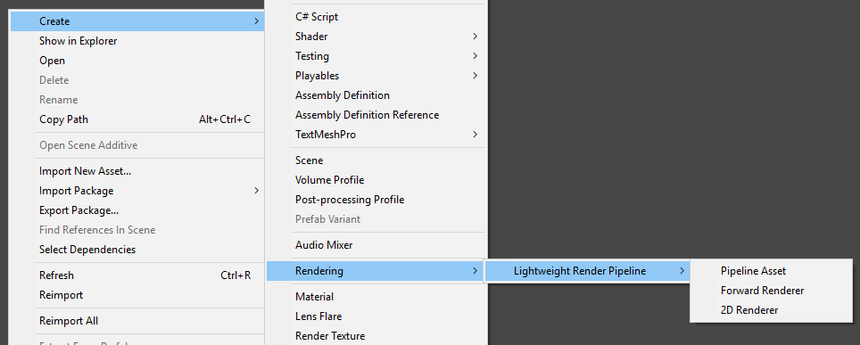

# Requirements and setup

Install the following Editor and package versions to work with the 2D Renderer:

- __Unity 2019.2.0b1__ or later

- __Universal Render Pipeline__ version 6.7 or higher (available via the Package Manager)

## Configuring the 2D Renderer

1. Create a new __Pipeline Asset__ by going to the __Assets__ menu and selecting __Create > Rendering > Universal Render Pipeline > Pipeline Asset__
2. Create a new __2D Renderer__ by going to  the Assets menu and selecting __Create > Rendering > Universal Render Pipeline > 2D Renderer__

3. Select the __Pipeline Asset__ and set its __Renderer Type__ to __Custom__.

4. Drag the __2D Renderer__ Asset onto the Data box, or select the circle icon to the right of the box to open the __Select Object__ window, then select the __2D Renderer__ Asset from the list.

5. Go to __Edit > Project Settings__, and select the __Graphics__ category. Set the __Scriptable Render Pipeline Settings __to your created __Pipeline Asset __by dragging the Asset directly onto the box, or by selecting the circle icon to the right of the box to open the __Select Object__ window and selecting the Asset from the list.

The __2D Renderer__ should now be configured for your Project.

__Note:__ If you have the experimental 2D Renderer enabled, some of the options related to 3D rendering in the Universal RP Asset will not have any impact on your final app or game.
